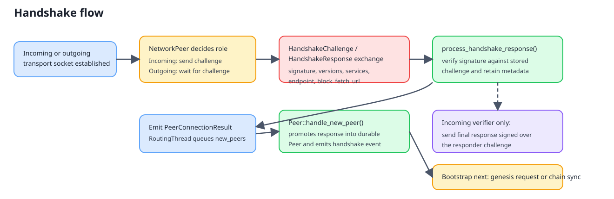
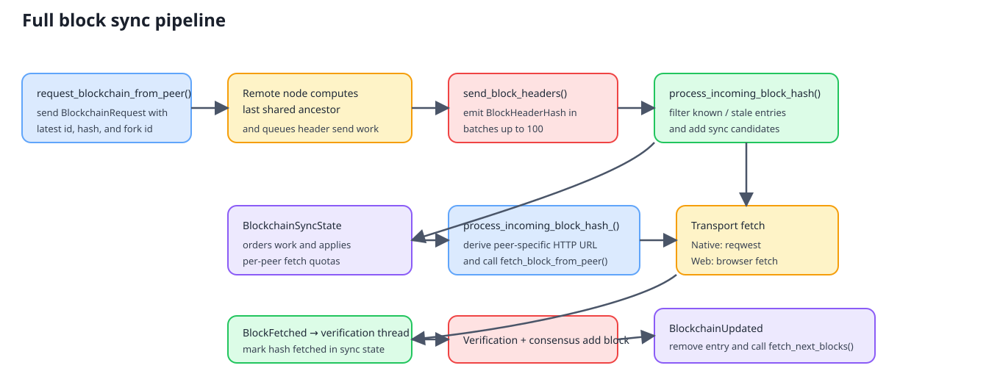
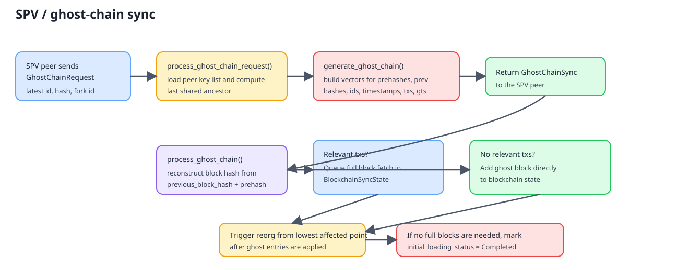

# Handshake And Block Sync: Current Implementation

## Scope

The active implementation lives in Rust core and is reused by both runtime surfaces:

- Native node transport: `rust/saito-rust/src/network_controller.rs`
- Wasm/js bridge: `rust/saito-wasm/src/wasm_io_handler.rs`, `rust/saito-wasm/src/saitowasm.rs`, and `rust/saito-js/lib/custom/shared_methods.web.ts`
- Core protocol logic: `rust/saito-core/src/core/routing_thread.rs`, `rust/saito-core/src/core/routing/peers/network_peer.rs`, `rust/saito-core/src/core/routing/peers/peer.rs`, `rust/saito-core/src/core/routing/blockchain_sync_state.rs`

The transport layers differ, but handshake state transitions and block-sync decisions are implemented in the Rust core path.

## Handshake Flow

### Message Types

The peer protocol uses these message variants:

- `HandshakeChallenge`
- `HandshakeResponse`
- `BlockchainRequest`
- `GhostChainRequest`
- `BlockHeaderHash`
- `GenesisBlockRequest`
- `GenesisBlockHeader`

`HandshakeResponse` carries:

- peer public key
- signature over the received challenge
- a new challenge for the other side to sign
- lite/full-node flag
- block fetch base URL
- peer services
- wallet/core versions
- endpoint
- peer timestamp

### Connection Roles

There are two connection roles in the current implementation:

- Incoming connection: `NetworkPeer.url` is `None`
- Outgoing connection: `NetworkPeer.url` is `Some(url)`

That distinction controls who sends the first challenge and who sends the final acknowledgement response.

### Stage-by-Stage Flow

1. Transport creation

- Native outbound connections are opened by `InterfaceIO::connect_to_peer(...)`, which routes into `NetworkController::connect_to_peer(...)`.
- Web clients do the same through `shared_methods.web.ts`, which opens a browser `WebSocket` and forwards every received buffer into the wasm/runtime bridge.

2. Initial challenge

- Incoming native connections call `NetworkController::handle_new_connection(...)` with `url == None`.
- In that case the node immediately generates a random challenge and sends `Message::HandshakeChallenge`.
- Outgoing connections do not send the first message; they wait for the remote challenge.

3. Challenge response

- `NetworkPeer::process_incoming_buffer(...)` deserializes the challenge.
- `process_handshake_challenge(...)` signs the received challenge with the local wallet key.
- It also generates a new challenge that the remote side must sign next.
- The returned `HandshakeResponse` includes local metadata such as services, versions, endpoint, and block fetch URL.

4. Challenge verification

- When a peer with an outstanding challenge receives `HandshakeResponse`, `process_handshake_response(...)` verifies the signature against the stored challenge.
- On success, it stores:
  - `public_key`
  - the full `HandshakeResponse`
  - peer metadata needed by later routing and sync code

5. Final acknowledgement

- If the verifier is the incoming side (`url == None`), it sends a second `HandshakeResponse`.
- That final response signs the new challenge issued by the responder and sets `challenge` to zeroes.
- If the verifier is the outgoing side (`url != None`), the handshake completes immediately after verification.

6. Promotion into routing

- On successful verification, the network layer emits `NetworkEvent::PeerConnectionResult { result: Ok(network_peer) }`.
- `RoutingThread` queues that `NetworkPeer` in `new_peers`.
- `handle_new_peer(...)` later finalizes it into a stable `Peer` record.

### Peer Finalization

`Peer::handle_new_peer(...)` copies the handshake metadata into the durable peer record:

- `block_fetch_url`
- `services`
- `wallet_version`
- `core_version`
- `endpoint`
- `connected_at_peer_time`
- `connected_at_my_time`

It also:

- marks the peer `Connected`
- broadcasts the local key list
- emits `InterfaceEvent::PeerHandshakeComplete`

After that, `RoutingThread::handle_new_peer(...)` starts blockchain bootstrap:

- if the local node has no blocks and is not a browser, it sends `GenesisBlockRequest`
- otherwise it immediately requests blockchain sync from that peer

## Full Block Sync Flow

### 1. Requesting blockchain state

`request_blockchain_from_peer(...)` is the main entry point.

For full nodes it sends `Message::BlockchainRequest` containing:

- latest known block id
- latest known block hash
- local fork id

This request is sent once per connected peer until the peer disconnects and reconnects.

### 2. Serving a blockchain request

`process_incoming_blockchain_request(...)` handles the request on the serving node.

It:

- rejects repeated requests from the same connected peer
- computes the last shared ancestor using the request block id and fork id
- disconnects peers that are far behind with no valid shared ancestor
- queues a header-send job in `blockchain_send_results`

The actual header transmission is timer-driven by `send_block_headers()`.

### 3. Sending headers

`send_block_headers()` runs from the routing timer.

It sends up to 100 `BlockHeaderHash` messages per pass for each queued peer, advancing the queued range until the full requested span has been sent.

### 4. Receiving headers

`process_incoming_block_hash(...)` receives each announced `(block_hash, block_id)`.

It first filters out work that is already too old or already known. For remaining candidates it adds entries into `BlockchainSyncState`.

### 5. Building the fetch queue

`BlockchainSyncState` maintains two structures:

- `received_block_picture`: raw block announcements seen from each peer
- `blocks_to_fetch`: ordered fetch work with per-block status (`Queued`, `Fetching`, `Fetched`, `Failed`)

`build_peer_block_picture(...)` moves announced headers into ordered fetch queues, removing anything already present in the local chain.

`get_blocks_to_fetch_per_peer(...)` then:

- sorts queued work by block id and hash
- limits concurrent fetches per peer to `batch_size`
- re-queues failed entries up to `MAX_RETRIES_PER_BLOCK`

### 6. Fetching full blocks

`fetch_next_blocks()` is called from the routing timer and after blockchain updates.

For each selected `(hash, id)` pair it calls `process_incoming_block_hash_(...)`, which:

- checks whether the block already exists in chain or mempool queue
- resolves the peer record
- derives the concrete fetch URL from `peer.block_fetch_url`
- routes the fetch into `InterfaceIO::fetch_block_from_peer(...)`

Transport-specific behavior:

- Native runtime: `NetworkController::fetch_block(...)` uses `reqwest` and emits `NetworkEvent::BlockFetched` or `NetworkEvent::BlockFetchFailed`
- Web runtime: `shared_methods.web.ts` uses browser `fetch(...)`, then calls wasm `process_fetched_block(...)` or `process_failed_block_fetch(...)`

### 7. Verification and chain update

On `NetworkEvent::BlockFetched`:

- routing forwards the raw block buffer to a verification thread
- the sync state marks that hash as fetched

After verification and successful chain insertion, `RoutingEvent::BlockchainUpdated(...)`:

- removes the block from sync state
- calls `fetch_next_blocks()` again to continue the pipeline

On `NetworkEvent::BlockFetchFailed` the sync state marks the entry failed so it can be retried later.

## Genesis Bootstrap Path

There is a dedicated empty-chain bootstrap path.

1. After the first successful handshake, if the node has no latest block and is not in browser mode, it sends `GenesisBlockRequest`.
2. The peer replies with `GenesisBlockHeader` containing the current genesis block hash and id.
3. That header goes through the normal `process_incoming_block_hash(...)` path and fetch pipeline.
4. Once the initial sync block is added, `RoutingEvent::BlockchainUpdated(..., initial_sync = true)`:
   - sets `waiting_for_genesis_block = false`
   - updates `genesis_block_id`
   - requests the rest of the chain from all connected peers

While `waiting_for_genesis_block` is true, ordinary incoming block headers are ignored to keep startup ordered.

## Lite And SPV Sync Flow

When the local node is in SPV mode, `request_blockchain_from_peer(...)` sends `Message::GhostChainRequest` instead of `BlockchainRequest`.

### Ghost-chain generation

`process_ghost_chain_request(...)`:

- loads the requesting peer and its key list
- computes the last shared ancestor
- calls `generate_ghost_chain(...)`

The generated `GhostChainSync` contains parallel vectors of:

- prehashes
- previous block hashes
- block ids
- timestamps
- whether the block has relevant transactions (`txs`)
- whether the block has a golden ticket (`gts`)

### Ghost-chain application

`process_ghost_chain(...)` reconstructs each block hash from:

- the previous block hash
- the announced prehash

Then it branches per block:

- if `txs[i]` is true, it queues the real block for later fetch through `BlockchainSyncState`
- otherwise it adds the block as a ghost block directly to blockchain state

After processing the chain, it triggers a reorg to the lowest affected point and, if no full blocks are needed, marks `initial_loading_status` as `Completed`.

This means ghost-chain sync is a selective fetch path: lite clients only download full blocks the server reports as relevant.

## Adapter Layer Responsibilities

### Native runtime

`rust/saito-rust/src/network_controller.rs` owns:

- websocket connect and receive loops
- socket ownership by public key
- HTTP block fetch via `reqwest`
- conversion from transport activity into `NetworkEvent`

### Wasm/js runtime

`rust/saito-wasm/src/saitowasm.rs` exposes the core routing methods to JS.

`rust/saito-wasm/src/wasm_io_handler.rs` maps interface events back into JS callbacks such as:

- `handshake_complete`
- `peer_connect`
- `peer_disconnect`
- block fetch status updates

`rust/saito-js/lib/custom/shared_methods.web.ts` owns browser transport details:

- open WebSocket
- forward incoming binary messages into wasm `process_msg_buffer_from_peer(...)`
- send returned handshake buffers back over the socket
- fetch blocks over HTTP when the wasm bridge requests it

## Current Characteristics

The current design has a clear layering:

- transport delivers bytes
- `NetworkPeer` performs handshake state transitions
- `RoutingThread` turns authenticated peers into sync work
- `BlockchainSyncState` schedules block downloads
- verification and consensus own block acceptance

The main complexity comes from the fact that block sync uses two different data planes:

- websocket messages for peer protocol control
- HTTP fetch for full block bodies

That split is central to how the current implementation works today.