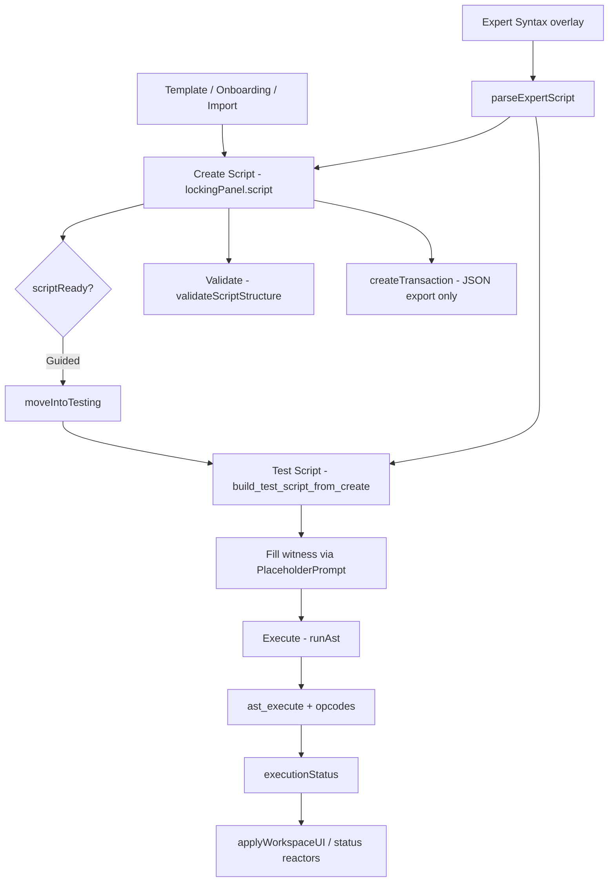

# RustScript Module — Architectural Audit

**Scope:** `node/mods/rustscript/` (52 files)  
**Date:** 2026-05-26  
**Purpose:** Factual inventory before further changes. No code modifications proposed in Sections 1–6; Section 7 lists removal candidates only; Section 8 defines Rust/UI boundary.

---

## SECTION 1: COMPLETE FILE INVENTORY

Module root: `node/mods/rustscript/`

---

### FILE: rustscript.js

**Purpose:** Saito mod entrypoint. Registers opcodes, wires UI, exposes parser/executor API to the browser.

**Exports:**

* `Rustscript` class (default export via `module.exports`)

**Public methods on `Rustscript`:**

* `initialize(app)`
* `render()`
* `buildContext(derived = {})`
* `evaluateCondition(hopContext, condition, context = {})`
* `parseExpertScript(source, execution_input = {})`
* `runAst(unlockingScript, execution_input = {})`

**Called By:**

* Saito node mod loader (parent `node/` framework)

**Category:** Runtime bridge + UI host

**Required For Rust:** PARTIAL — opcode registry, `buildContext`, `evaluateCondition`, and bridge methods should become thin WASM/FFI wrappers; UI wiring stays JS.

**Notes:** Imports `build_test_script_from_create` from UI (`script_build.js`) inside `parseExpertScript`, coupling runtime parse path to UI witness scaffolding.

---

### FILE: README.txt

**Purpose:** Module documentation (AST shape, runtime/parser paths, UI pointers).

**Exports:** None (plain text)

**Called By:** Developers (manual reference)

**Category:** Utility (documentation)

**Required For Rust:** NO

**Notes:** Documents hashing and execution contracts.

---

### FILE: lib/rustscript/semantic_to_tokens.js

**Purpose:** Lexical analysis — semantic text → token stream.

**Exports:**

* `tokenize(input)`

**Called By:**

* `rustscript.js` (`parseExpertScript`)

**Category:** Parser

**Required For Rust:** YES

**Notes:** Single-pass tokenizer; tokens carry `type`, `value`, `line`, `column`.

---

### FILE: lib/rustscript/tokens_to_ast.js

**Purpose:** Recursive-descent parser — tokens → canonical AST.

**Exports:**

* `parse(tokens)`

**Called By:**

* `rustscript.js` (`parseExpertScript`)

**Category:** Parser

**Required For Rust:** YES

**Notes:** Precedence: THEN < OR < AND < NOT. Leaf form: `OPCODE` or `OPCODE[field=value, …]`.

---

### FILE: lib/rustscript/ast_execute.js

**Purpose:** AST interpreter — evaluates logical combinators and dispatches leaf opcodes.

**Exports:**

* `execute(ast, context)`

**Called By:**

* `rustscript.js` (`parseExpertScript`, `runAst`)

**Category:** Runtime

**Required For Rust:** YES

**Notes:** Handles `and`, `or`, `not`, `then`; leaf opcodes via `context.opcodes[op].execute(node, context)`.

---

### FILE: lib/rustscript/script_to_scripthash.js

**Purpose:** Deterministic Blake3 hash of script JSON (stable key sort, UTF-8, hex digest).

**Exports:**

* `script_to_scripthash(script)` (default export)

**Called By:**

* None in current codebase (documented in README only; not wired into UI or mod)

**Category:** Runtime (hashing)

**Required For Rust:** YES

**Notes:** Orphaned from UI flow today. Critical for on-chain locking script commitment.

---

### FILE: lib/opcodes/field_lookup.js

**Purpose:** Shared opcode helper — resolve unlock fields from `node.required` then `node.witness`.

**Exports:**

* `lookupField(node, key)`
* `isUnsetFieldValue(value)`

**Called By:**

* `checksig.js`, `checkmultisig.js`, `checkhash.js`, `checkpath.js`, `checkpathhop.js`, `checkownnft.js`, `checkownnftwhere.js`, `importfield.js`

**Category:** Opcode utility

**Required For Rust:** YES (same semantics in Rust opcodes)

**Notes:** `true` / `null` / `undefined` treated as unset.

---

### FILE: lib/opcodes/checksig.js

**Purpose:** CHECKSIG opcode — verify message signature.

**Exports:** Opcode object `{ name, description, exampleScript, exampleRequired, schema, execute }`

**Called By:**

* `rustscript.js` (opcode registry)
* `ast_execute.js` (via registry)

**Category:** Opcode

**Required For Rust:** YES

---

### FILE: lib/opcodes/checkmultisig.js

**Purpose:** CHECKMULTISIG opcode — M-of-N signature verification.

**Exports:** Opcode object

**Called By:** `rustscript.js`, `ast_execute.js`

**Category:** Opcode

**Required For Rust:** YES

---

### FILE: lib/opcodes/checkhash.js

**Purpose:** CHECKHASH opcode — Blake3 preimage check.

**Exports:** Opcode object

**Called By:** `rustscript.js`, `ast_execute.js`

**Category:** Opcode

**Required For Rust:** YES

---

### FILE: lib/opcodes/checktime.js

**Purpose:** CHECKTIME opcode — block timestamp comparison.

**Exports:** Opcode object

**Called By:** `rustscript.js`, `ast_execute.js`

**Category:** Opcode

**Required For Rust:** YES

**Notes:** Stub — always returns `true` after parse; TODO for real block comparison.

---

### FILE: lib/opcodes/checksender.js

**Purpose:** CHECKSENDER opcode — match tx sender to script publickey.

**Exports:** Opcode object

**Called By:** `rustscript.js`, `ast_execute.js`

**Category:** Opcode

**Required For Rust:** YES

---

### FILE: lib/opcodes/checkrecipient.js

**Purpose:** CHECKRECIPIENT opcode — verify output pays required publickey.

**Exports:** Opcode object

**Called By:** `rustscript.js`, `ast_execute.js`

**Category:** Opcode

**Required For Rust:** YES

---

### FILE: lib/opcodes/checkfield.js

**Purpose:** CHECKFIELD opcode — compare resolved var/literal values.

**Exports:** Opcode object

**Called By:** `rustscript.js`, `ast_execute.js`

**Category:** Opcode

**Required For Rust:** YES

**Notes:** Uses `context.app.browser.resolveVarReference`.

---

### FILE: lib/opcodes/checkown.js

**Purpose:** CHECKOWN opcode — slip spendability + tx signature check.

**Exports:** Opcode object

**Called By:** `rustscript.js`, `ast_execute.js`

**Category:** Opcode

**Required For Rust:** YES

**Notes:** Stub — returns `(is_slip_spendable && sig_ok) || true`.

---

### FILE: lib/opcodes/checkownnft.js

**Purpose:** CHECKOWNNFT opcode — NFT ownership via three utxokeys.

**Exports:** Opcode object

**Called By:** `rustscript.js`, `ast_execute.js`

**Category:** Opcode

**Required For Rust:** YES

**Notes:** Stub — returns `true` before unreachable dead code.

---

### FILE: lib/opcodes/checkownnftwhere.js

**Purpose:** CHECKOWNNFTWHERE opcode — NFT ownership + metadata WHERE clauses.

**Exports:** Opcode object

**Called By:** `rustscript.js`, `ast_execute.js`

**Category:** Opcode

**Required For Rust:** YES

**Notes:** Writes `context.__opcodes.checkownnftwhere.nft_id`. Uses wallet/blockchain helpers.

---

### FILE: lib/opcodes/checkpath.js

**Purpose:** CHECKPATH opcode — verify routing path from authority root.

**Exports:** Opcode object

**Called By:** `rustscript.js`, `ast_execute.js`

**Category:** Opcode

**Required For Rust:** YES

---

### FILE: lib/opcodes/checkpathhop.js

**Purpose:** CHECKPATHHOP opcode — routing path + WHERE filter + selector + ASSERT; writes hop to `__opcodes`.

**Exports:** Opcode object (uses `evaluateCondition` mixed in from mod)

**Called By:** `rustscript.js`, `ast_execute.js`

**Category:** Opcode

**Required For Rust:** YES

**Notes:** Production path verification; debug `console.log` present. Writes `context.__opcodes.checkpathhop.hop`.

---

### FILE: lib/opcodes/importfield.js

**Purpose:** IMPORTFIELD opcode — verify signed witness field, write to `__opcodes.importfield`.

**Exports:** Opcode object

**Called By:** `rustscript.js`, `ast_execute.js`

**Category:** Opcode

**Required For Rust:** YES

---

### FILE: lib/opcodes/sumfields.js

**Purpose:** SUMFIELDS opcode — add two resolved numbers, store in `__opcodes.sumfields`.

**Exports:** Opcode object

**Called By:** `rustscript.js`, `ast_execute.js`

**Category:** Opcode

**Required For Rust:** YES

---

### FILE: lib/ui/main.js

**Purpose:** Primary UI controller — workspace lifecycle, panels, status, execution/validation triggers, onboarding entry.

**Exports:**

* `RustscriptMain` class (default)

**Key methods:** `render`, `showOnboarding`, `enterCreateGuided`, `enterInteractGuided`, `enterExpertMode`, `applyWorkspaceUI`, `setWorkspaceMode`, `syncUnlockFromScript`, `moveIntoTesting`, `returnToScript`, `runExecution`, `validateLockingScript`, `createTransaction`, `loadTemplate`, `parseSemanticScript`, `onPanelChange`, …

**Called By:**

* `rustscript.js` (`this.ui = new RustscriptMain(...)`)

**Category:** UI

**Required For Rust:** NO

---

### FILE: lib/ui/main.template.js

**Purpose:** HTML shell for workspace (header, status reactors, panel mounts, template menu).

**Exports:**

* `RustscriptMainTemplate(app, mod)` → HTML string

**Called By:**

* `lib/ui/main.js` (`render`)

**Category:** Template

**Required For Rust:** NO

---

### FILE: lib/ui/script_build.js

**Purpose:** UI script tree transforms — clone locking script, scaffold/preserve `witness`, build test script from create script.

**Exports:**

* `isWitnessValueSupplied(value)`
* `witnessFieldNames(opcodes, opName)`
* `unlockWitnessFieldNames(opcodes, opName, node)`
* `cloneScriptTree(node)`
* `preserve_witness_in_tree(previous, next, opcodes)`
* `build_test_script_from_create(createScript, currentTest, opcodes)`
* `collectWitnessMissing(node, opcodes, path?)`
* `opcodeTreeNeedsWitness(node, opcodes)`

**Called By:**

* `lib/ui/main.js`
* `lib/ui/components/script_status.js`
* `lib/ui/components/semantic_script_view.js`
* `lib/ui/components/workspace_sync.js`
* `rustscript.js` (`parseExpertScript`) ← **runtime coupling**

**Category:** Utility (UI-primary; partially shared)

**Required For Rust:** NO for UI scaffolding; YES if semantic parse path must produce unlocking scripts server-side (logic would need Rust port or API boundary)

---

### FILE: lib/ui/script_validate.js

**Purpose:** Structural JSON validation for expert editing (combinator arity, no `witness` on locking script).

**Exports:**

* `validateScriptStructure(ast, options = {})`

**Called By:**

* `lib/ui/main.js` (`validateLockingScript`)
* `lib/ui/components/script_status.js`

**Category:** Utility (UI)

**Required For Rust:** NO (optional mirror for API validation)

---

### FILE: lib/ui/script_templates.js

**Purpose:** Build locking script seed from opcode `exampleScript`.

**Exports:**

* `template_locking(opcode)`

**Called By:**

* `lib/ui/main.js` (`loadOpcodeExample`)

**Category:** Utility (UI)

**Required For Rust:** NO

---

### FILE: lib/ui/onboarding/contract_templates.js

**Purpose:** Contract template catalog for onboarding and header template menu.

**Exports:**

* `getContractTemplates(opcodes)`
* `defaultStarterScript(opcodes)`
* `lockingFromOpcode(opcodes, opcodeName)`

**Called By:**

* `lib/ui/main.js`
* `lib/ui/overlays/onboarding.js`

**Category:** UI / utility

**Required For Rust:** NO

---

### FILE: lib/ui/components/rust_script_panel.js

**Purpose:** Single workspace panel (Create or Test) — semantic view, expert textarea, reference sidebar, value editor orchestration.

**Exports:**

* `RustScriptPanel` class (default)

**Called By:**

* `lib/ui/main.js` (`mountPanels`)

**Category:** UI

**Required For Rust:** NO

---

### FILE: lib/ui/components/semantic_script_view.js

**Purpose:** Guided semantic renderer — opcode tree, placeholders, witness block, logical operators.

**Exports:**

* `SemanticScriptView` class (default)

**Called By:**

* `lib/ui/components/rust_script_panel.js`

**Category:** UI (renderer)

**Required For Rust:** NO

---

### FILE: lib/ui/components/panel_reference_view.js

**Purpose:** Test-panel guidance sidebar (field counts, move-to-test, create-transaction CTAs).

**Exports:**

* `PanelReferenceView` class (default)

**Called By:**

* `lib/ui/components/rust_script_panel.js`

**Category:** UI (renderer)

**Required For Rust:** NO

---

### FILE: lib/ui/components/placeholder_prompt.js

**Purpose:** Modal overlay for editing placeholder/required/witness field values (including sign-message flow).

**Exports:**

* `PlaceholderPrompt` class (default)

**Called By:**

* `lib/ui/components/rust_script_panel.js`

**Category:** UI (overlay helper)

**Required For Rust:** NO

---

### FILE: lib/ui/components/placeholder_utils.js

**Purpose:** Placeholder detection, path get/set, required-field metadata.

**Exports:**

* `isPlaceholder(value)`
* `isRequiredMissing(value)`
* `placeholderName(value)`
* `placeholderMeta(value)`
* `requiredFieldMeta(value)`
* `setAtPath(obj, path, value)`
* `getAtPath(obj, path)`

**Called By:**

* `placeholder_prompt.js`, `semantic_script_view.js`, `field_validation.js`, `script_status.js`, `script_build.js`, `rust_script_panel.js`

**Category:** Utility (UI)

**Required For Rust:** NO

---

### FILE: lib/ui/components/field_validation.js

**Purpose:** Field kind inference, pubkey/signature validation, wallet key ownership checks for apply.

**Exports:**

* `inferFieldKind(value, meta?)`
* `inferFieldKindFromPath(path, value, meta?)`
* `isSaitoPublicKey(value)`
* `validateField(kind, value, context?)`
* `validateForApply(kind, value, context?)`
* `findSignableMessage(script, path, getLockingScript?)`
* `findSignatureContext(script, path, getLockingScript?)`
* `walletOwnsRequiredKey(publickey, app?)`

**Called By:**

* `semantic_script_view.js`, `placeholder_prompt.js`, `rust_script_panel.js`

**Category:** Utility (UI)

**Required For Rust:** NO

---

### FILE: lib/ui/components/logical_operators.js

**Purpose:** UI labels/explanations for AND/OR/NOT/THEN combinators.

**Exports:**

* `LOGICAL_OPERATORS`
* `isLogicalOperator(value)`
* `normalizeLogicalOperator(value)`
* `explainLogicalOperator(op)`

**Called By:**

* `semantic_script_view.js`, `placeholder_prompt.js`, `rust_script_panel.js`

**Category:** Utility (UI)

**Required For Rust:** NO

---

### FILE: lib/ui/components/script_status.js

**Purpose:** Workspace lifecycle evaluation (SCRIPT / REQUIRED / VALID status objects).

**Exports:**

* `evaluateWorkspaceStatus(lockingScript, unlockingScript, execution, opcodes)`
* `evaluateScriptStatus(lockingScript)`
* `evaluateRequiredStatus(testScript, execution, opcodes)`
* `evaluateValidStatus(scriptStatus, requiredStatus, execution)`
* `collectPlaceholders(node, path?, options?)`
* `isEmptyScript(script)`
* `isWitnessValueSupplied` (re-export from `script_build.js`)

**Called By:**

* `lib/ui/main.js`

**Category:** Utility (UI)

**Required For Rust:** NO

---

### FILE: lib/ui/components/workspace_sync.js

**Purpose:** Thin wrapper for test-script materialization; witness/required path predicates.

**Exports:**

* `materializeUnlockFromScript(lockingScript, currentUnlocking, opcodes)`
* `isWitnessPath(path)`
* `isEmbeddedRequiredPath(path)`

**Called By:**

* `semantic_script_view.js` (`isWitnessPath`)
* `rust_script_panel.js` (`isWitnessPath`)

**Notes:** `materializeUnlockFromScript` and `isEmbeddedRequiredPath` are **exported but unused** elsewhere in the module. Main uses `build_test_script_from_create` directly.

**Category:** Utility (UI) — partially obsolete

**Required For Rust:** NO

---

### FILE: lib/ui/components/opcode_reference.js

**Purpose:** Build opcode documentation HTML for reference overlay.

**Exports:**

* `OpcodeReference` class (default)

**Called By:**

* `lib/ui/components/opcode_reference_overlay.js`

**Category:** UI (renderer)

**Required For Rust:** NO

---

### FILE: lib/ui/components/opcode_reference_overlay.js

**Purpose:** Full-screen opcode reference browser overlay.

**Exports:**

* `OpcodeReferenceOverlay` class (default)

**Called By:**

* `lib/ui/main.js`

**Category:** UI (overlay)

**Required For Rust:** NO

---

### FILE: lib/ui/overlays/onboarding.js

**Purpose:** First-run / welcome multi-step onboarding flow.

**Exports:**

* `OnboardingOverlay` class (default)
* `OnboardingOverlay.shouldShow(app)` (static)

**Called By:**

* `lib/ui/main.js`

**Category:** Overlay

**Required For Rust:** NO

---

### FILE: lib/ui/overlays/onboarding.template.js

**Purpose:** HTML fragments for onboarding steps (splash, create choice, template picker, interact).

**Exports:**

* `OnboardingSplashTemplate()`
* `OnboardingCreateChoiceTemplate()`
* `OnboardingTemplatePickerTemplate(templates)`
* `OnboardingInteractTemplate()`

**Called By:**

* `lib/ui/overlays/onboarding.js`

**Category:** Template

**Required For Rust:** NO

---

### FILE: lib/ui/overlays/generate_expert.js

**Purpose:** Expert syntax overlay — human-readable semantic text → parse → populate panels.

**Exports:**

* `GenerateExpertOverlay` class (default)

**Called By:**

* `rustscript.js` (constructed on mod)
* `lib/ui/main.js` (Expert Syntax button)

**Category:** Overlay

**Required For Rust:** NO (UI entry to parser; parser itself is Rust-bound)

---

### FILE: web/index.html

**Purpose:** Standalone dev HTML page for the mod.

**Exports:** N/A

**Called By:** Browser / local dev server

**Category:** UI (static)

**Required For Rust:** NO

---

### FILE: web/css/rustscript-base.css

**Purpose:** Base typography and layout tokens for RustScript UI.

**Category:** UI (stylesheet)

**Required For Rust:** NO

---

### FILE: web/css/rustscript-main.css

**Purpose:** Main workspace chrome styles.

**Category:** UI (stylesheet)

**Required For Rust:** NO

---

### FILE: web/css/rustscript-workspace.css

**Purpose:** Guided/expert workspace layout, dual-pane, mode toggles.

**Category:** UI (stylesheet)

**Required For Rust:** NO

---

### FILE: web/css/rustscript-panel.css

**Purpose:** Create/Test panel shell, textarea, semantic container.

**Category:** UI (stylesheet)

**Required For Rust:** NO

---

### FILE: web/css/rustscript-panel-reference.css

**Purpose:** Test-panel reference/guidance sidebar.

**Category:** UI (stylesheet)

**Required For Rust:** NO

---

### FILE: web/css/rustscript-status.css

**Purpose:** SCRIPT / REQUIRED / VALID status reactor styling.

**Category:** UI (stylesheet)

**Required For Rust:** NO

---

### FILE: web/css/rustscript-reference.css

**Purpose:** Opcode reference overlay documentation styling.

**Category:** UI (stylesheet)

**Required For Rust:** NO

---

### FILE: web/css/rustscript-overlay.css

**Purpose:** Generic overlay and generate-expert overlay styles.

**Category:** UI (stylesheet)

**Required For Rust:** NO

---

### FILE: web/css/rustscript-onboarding.css

**Purpose:** Onboarding overlay fullscreen layout and steps.

**Category:** UI (stylesheet)

**Required For Rust:** NO

---

### FILE: web/css/rustscript-eval-panel.css

**Purpose:** Styles for evaluation-related panel UI (legacy naming; may overlap panel styles).

**Category:** UI (stylesheet)

**Required For Rust:** NO

---

### FILE: (referenced, not in tree) `/rustscript/style.css`

**Purpose:** Bundled aggregate stylesheet referenced by `rustscript.js` (`this.styles`) and `web/index.html`.

**Exports:** N/A

**Called By:** Saito mod CSS loader

**Category:** UI (build artifact)

**Required For Rust:** NO

**Notes:** Source is likely compiled from `web/css/*.css` at build time; not present as a single file in the mod directory.

---

### Deleted / absent (historical)

**FILE: lib/ui/overlays/new_script.js** — Removed in recent work; was duplicate new-script init path. **Category:** Obsolete (deleted).

---

## SECTION 2: COMPLETE UI INVENTORY

| Component | File | Purpose | Inputs | Outputs | Owns State? | Survive Simplification? |
|-----------|------|---------|--------|---------|-------------|-------------------------|
| **Main workspace controller** | `lib/ui/main.js` | Orchestrates entire UI lifecycle | User events, panel callbacks, mod API | DOM updates, panel script JSON, status | YES — see Section 5 | YES — central coordinator |
| **Main HTML template** | `lib/ui/main.template.js` | Static workspace shell | `app`, `mod` | HTML string | NO | YES |
| **Create Script panel** | `rust_script_panel.js` (`role: 'create'`) | Locking script authoring | `script` object, workspace flags | Semantic HTML or expert JSON textarea | YES — `script`, `displayMode`, DOM refs | YES |
| **Test Script panel** | `rust_script_panel.js` (`role: 'test'`) | Unlocking script + witness editing | Merged test `script`, `referenceContext` | Semantic HTML, reference sidebar, expert JSON | YES — same as create panel instance | YES |
| **Semantic renderer (Guided)** | `semantic_script_view.js` | Renders AST as interactive semantic tree | Script object, panel role, interaction flags | DOM tree, click handlers | Config state only (`panelRole`, callbacks) | YES — primary guided UX |
| **Expert renderer** | `rust_script_panel.js` (textarea + `displayMode: 'source'`) | Raw JSON editing | `panel.script` | Parsed JSON on sync | Uses panel `script` | YES — needed for Expert mode |
| **Reference / guidance panel** | `panel_reference_view.js` | Contextual checklist and CTAs on Test panel | `referenceContext` (phase, counts, callbacks) | HTML list + buttons | YES — `lastContext` | MAYBE — could merge into test panel |
| **Placeholder / field editor** | `placeholder_prompt.js` | Modal for filling placeholders, signatures | Path, value, field kind, locking script | Updated script path via callback | YES — `liveHash`, `activeRoot`, overlay | YES |
| **Opcode reference overlay** | `opcode_reference_overlay.js` + `opcode_reference.js` | Browse opcode docs | Opcode key | Overlay HTML | YES — overlay instance | MAYBE — dev/docs feature |
| **Onboarding overlay** | `onboarding.js` + `onboarding.template.js` | Welcome, template pick, mode intro | `step`, templates | Calls `mainUi.enterCreateGuided`, etc. | YES — `step`, overlay | YES — primary entry for new users |
| **Generate Expert overlay** | `generate_expert.js` | Semantic text authoring | Textarea input | Calls `mod.parseExpertScript` | YES — overlay | MAYBE — overlaps with expert textarea path |
| **Template selector (header)** | `main.js` `mountTemplateMenu` | Quick template load from header | `getContractTemplates` | `loadTemplate(locking)` | NO (uses DOM menu) | YES |
| **Template catalog** | `contract_templates.js` | Template definitions | `opcodes` registry | Template objects | NO | YES |
| **Opcode example loader** | `script_templates.js` + `main.loadOpcodeExample` | Load single-opcode example | Opcode metadata | Locking script object | NO | MAYBE |
| **Field validation helper** | `field_validation.js` | Validate keys, signatures before apply | Value, path, kind | `{ valid, message }` | NO | YES |
| **Placeholder utilities** | `placeholder_utils.js` | Placeholder syntax, path mutation | Strings, paths | Booleans, metadata, mutated objects | NO | YES |
| **Logical operator helper** | `logical_operators.js` | Combinator labels for UI | Operator string | Normalized op, explanation | NO | YES (small) |
| **Script status / lifecycle** | `script_status.js` | SCRIPT/REQUIRED/VALID evaluation | Locking + test scripts, execution flags | Status objects | NO | YES |
| **Workspace sync helper** | `workspace_sync.js` | Witness path checks; unused materialize | Scripts, opcodes | Merged script (unused path) | NO | **NO** — candidate removal |
| **Script build / witness scaffold** | `script_build.js` | Create→test script merge, witness preservation | Locking script, current test, opcodes | Test script tree | NO | YES (until Rust owns witness scaffold) |
| **Structural validator** | `script_validate.js` | Expert JSON shape check | AST, `{ locking: true }` | `{ valid, errors }` | NO | YES |
| **Status panel (header)** | `main.template.js` + `main.refreshStatusIndicators` | Three reactor indicators | `evaluateWorkspaceStatus` | DOM `data-state` | NO (derived) | YES |
| **Guidance panel** | `panel_reference_view.js` | Same as Reference panel above | `referenceContext` | HTML | — | — |
| **Workspace mode toggle** | `main.js` `setWorkspaceMode` / `updateWorkspaceToggle` | Guided ↔ Expert | User click | CSS classes, panel resync | Uses `workspaceMode` on main | YES |
| **Import script** | `main.js` `attachEvents` | Load JSON file | File contents | Locking/unlocking scripts | NO | MAYBE |
| **CSS layer (9 files + bundle)** | `web/css/*.css` | Visual presentation | — | Styles | NO | YES (consolidation candidate) |

**Render modes inside `RustScriptPanel`:**

| `displayMode` | Renderer | When |
|---------------|----------|------|
| `semantic` | `SemanticScriptView` | Guided mode default |
| `source` | `<textarea>` expert JSON | Expert mode |
| `reference` | (unused as primary; reference is sibling column on test panel) | — |

**Synchronization components:**

| Flow | Functions | Files |
|------|-----------|-------|
| Create → Test script | `syncUnlockFromScript` → `build_test_script_from_create` | `main.js`, `script_build.js` |
| Expert textarea → in-memory | `syncPanelsFromTextareas` | `main.js` |
| Panel → main on edit | `onPanelChange` | `main.js` ← `rust_script_panel` |
| Full UI refresh | `applyWorkspaceUI` | `main.js` |
| Parse success | `onParseSuccess` | `main.js` ← `generate_expert.js` / future callers |

---

## SECTION 3: COMPLETE RUNTIME INVENTORY

### Tokenization

**File:** `lib/rustscript/semantic_to_tokens.js`

| Function | Input | Output |
|----------|-------|--------|
| `tokenize(input)` | `input`: string (semantic script text) | `tokens`: array of `{ type, value, line, column }` |

Token types include identifiers, operators (`AND`, `OR`, `NOT`, `THEN`), brackets, commas, strings, numbers, EOF.

---

### Parsing

**File:** `lib/rustscript/tokens_to_ast.js`

| Function | Input | Output |
|----------|-------|--------|
| `parse(tokens)` | `tokens`: array from tokenize | `ast`: single root node — either combinator `{ op, args[] }` or leaf `{ op, ...fields, required?, witness? }` |

Throws if token stream empty or malformed.

---

### AST execution

**File:** `lib/rustscript/ast_execute.js`

| Function | Input | Output |
|----------|-------|--------|
| `execute(ast, context)` | `ast`: script tree; `context`: execution environment (see below) | `boolean` — `true` if script satisfied, else `false` |

**Context shape (from `rustscript.buildContext`):**

```
{
  app,                  // Saito application (crypto, browser, wallet, blockchain)
  opcodes,              // map name → opcode module
  tx,                   // transaction object (default {})
  block,                // block object (default {})
  variables,            // user vars (default {})
  __opcodes,            // opcode-written namespaced values {}
  ...derived            // spread from caller
}
```

---

### Script hashing

**File:** `lib/rustscript/script_to_scripthash.js`

| Function | Input | Output |
|----------|-------|--------|
| `script_to_scripthash(script)` | `script`: plain object (locking AST) | `string` — 64-char lowercase hex Blake3 hash |

Internal: `stableJsonStringify(script)` → UTF-8 → Blake3.

**Not invoked** anywhere in live UI or mod code today.

---

### Mod-level runtime API

**File:** `rustscript.js`

| Function | Input | Output |
|----------|-------|--------|
| `buildContext(derived = {})` | Optional partial context | Full context object |
| `evaluateCondition(hopContext, condition, context = {})` | Hop object, `{ field, operator, value, type? }`, context | `boolean` |
| `parseExpertScript(source, execution_input = {})` | Semantic string; optional execution input | `{ tokens, ast, lockingScript, unlockingScript, json, execution }` |
| `runAst(unlockingScript, execution_input = {})` | Test/unlocking AST; optional context overrides | `boolean` |

**`parseExpertScript` pipeline:**

1. `tokenize(text)` → tokens  
2. `parse(tokens)` → ast (locking shape)  
3. `build_test_script_from_create(ast, {}, opcodes)` → unlocking script (**UI module**)  
4. `buildContext(execution_input)` → context  
5. `execute(script, context)` → execution boolean  

---

### Opcode execution (leaf runtime)

Each opcode: `execute(node, context) → boolean`

Registered in `rustscript.initialize` — 14 opcodes (see Section 4).

Logical combinators handled only in `ast_execute.js`, not as separate files.

---

## SECTION 4: COMPLETE OPCODE INVENTORY

Convention: **Witness fields** are listed in each opcode's `exampleRequired`. At unlock time the UI places unsatisfied fields under `node.witness`. Embedded locking commitments use `node.required`. All witness-aware opcodes use `lookupField(node, key)` = `node.required?.[key] ?? node.witness?.[key]`.

---

### CHECKSIG

**File:** `lib/opcodes/checksig.js`  
**Execute:** `execute(node, context)`

| | Fields |
|---|--------|
| **Required (script)** | `publickey`, `msg` |
| **Optional (script)** | — |
| **Witness / required** | `signature` (via lookupField) |
| **Reads context** | `context.app.crypto.verifyMessage` |
| **Writes context** | No |
| **Uses __opcodes** | No |

**Returns:** `true` if signature verifies message for publickey.

**Status:** Production (crypto verify).

---

### CHECKMULTISIG

**File:** `lib/opcodes/checkmultisig.js`  
**Execute:** `execute(node, context)`

| | Fields |
|---|--------|
| **Required (script)** | `publickeys[]`, `m`, `msg` |
| **Optional** | `m` defaults to `publickeys.length` |
| **Witness** | `signatures[]` |
| **Reads context** | `context.app.crypto.verifyMessage` |
| **Writes context** | No |
| **Uses __opcodes** | No |

**Status:** Production.

---

### CHECKHASH

**File:** `lib/opcodes/checkhash.js`

| | Fields |
|---|--------|
| **Required (script)** | `hash` |
| **Witness** | `input` (preimage) |
| **Reads context** | `context.app.crypto.hash` |
| **Writes context** | No |
| **Uses __opcodes** | No |

**Status:** Production.

---

### CHECKTIME

**File:** `lib/opcodes/checktime.js`

| | Fields |
|---|--------|
| **Required (script)** | `timestamp`, `operator` |
| **Witness** | None |
| **Reads context** | Should read `context.block` (not implemented) |
| **Writes context** | No |
| **Uses __opcodes** | No |

**Status:** **Stub** — parses timestamp, returns `true` always.

---

### CHECKSENDER

**File:** `lib/opcodes/checksender.js`

| | Fields |
|---|--------|
| **Required (script)** | `publickey` |
| **Witness** | None |
| **Reads context** | `context.tx.sender` or `context['tx.sender']` or `context.sender` |
| **Writes context** | No |
| **Uses __opcodes** | No |

**Status:** Production (simple string compare).

---

### CHECKRECIPIENT

**File:** `lib/opcodes/checkrecipient.js`

| | Fields |
|---|--------|
| **Required (script)** | `publickey` |
| **Witness** | None |
| **Reads context** | `context.tx.to` / outputs |
| **Writes context** | No |
| **Uses __opcodes** | No |

**Status:** Production.

---

### CHECKFIELD

**File:** `lib/opcodes/checkfield.js`

| | Fields |
|---|--------|
| **Required (script)** | `field`, `operator`, `value` |
| **Witness** | None |
| **Reads context** | `context.app.browser.resolveVarReference` for both sides |
| **Writes context** | No |
| **Uses __opcodes** | Reads via var refs e.g. `__opcodes.sumfields.expiry` |

**Status:** Production.

---

### CHECKOWN

**File:** `lib/opcodes/checkown.js`

| | Fields |
|---|--------|
| **Required (script)** | `utxokey` |
| **Witness** | None |
| **Reads context** | `context.app.blockchain.isSlipSpendable`, `context.tx` signature APIs |
| **Writes context** | No |
| **Uses __opcodes** | No |

**Status:** **Stub** — `(is_slip_spendable && sig_ok) || true`.

---

### CHECKOWNNFT

**File:** `lib/opcodes/checkownnft.js`

| | Fields |
|---|--------|
| **Required (script)** | `nftid` |
| **Witness** | `utxokey1`, `utxokey2`, `utxokey3` |
| **Reads context** | `context.tx.from` (partial); chain checks commented out |
| **Writes context** | No |
| **Uses __opcodes** | No |

**Status:** **Stub** — returns `true`; dead code below.

---

### CHECKOWNNFTWHERE

**File:** `lib/opcodes/checkownnftwhere.js`

| | Fields |
|---|--------|
| **Required (script)** | `where[]` (field/operator/value clauses) |
| **Witness** | `utxokey1`, `utxokey2`, `utxokey3` |
| **Reads context** | `context.tx`, `context.app.wallet.extractNFTType`, Slip parsing |
| **Writes context** | **Yes** — `context.__opcodes.checkownnftwhere.nft_id` |
| **Uses __opcodes** | Writes to own namespace |

**Status:** Partial production — ownership + WHERE work; spendability not fully enforced.

---

### CHECKPATH

**File:** `lib/opcodes/checkpath.js`

| | Fields |
|---|--------|
| **Required (script)** | `publickey`, optional `hash` |
| **Witness** | `hops[]` |
| **Reads context** | `context.app.crypto.verifyRoutingPath` |
| **Writes context** | No |
| **Uses __opcodes** | No |

**Status:** Production (delegates to crypto layer).

---

### CHECKPATHHOP

**File:** `lib/opcodes/checkpathhop.js`

| | Fields |
|---|--------|
| **Required (script)** | `publickey`, optional `hash`, `selector`, `where[]`, `assert[]` |
| **Witness** | `hops[]` |
| **Reads context** | `verifyRoutingPath`, `evaluateCondition` (from mod), var resolution |
| **Writes context** | **Yes** — `context.__opcodes.checkpathhop.hop` |
| **Uses __opcodes** | Writes hop; reads vars |

**Status:** Production (with debug logging).

---

### IMPORTFIELD

**File:** `lib/opcodes/importfield.js`

| | Fields |
|---|--------|
| **Required (script)** | `field`, `publickey`, `hash` (var refs allowed) |
| **Witness** | Dynamic field name + `signature` |
| **Reads context** | crypto hash/verify, var resolution |
| **Writes context** | **Yes** — `context.__opcodes.importfield[field_name]` |
| **Uses __opcodes** | Reads signer/hash from other opcodes' namespaces |

**Status:** Production.

---

### SUMFIELDS

**File:** `lib/opcodes/sumfields.js`

| | Fields |
|---|--------|
| **Required (script)** | `a`, `b`, `into` |
| **Witness** | None |
| **Reads context** | `resolveVarReference` for `a`, `b` |
| **Writes context** | **Yes** — `context.__opcodes.sumfields[into]` |
| **Uses __opcodes** | Reads other namespaces via var refs |

**Status:** Production.

---

### Shared helper: field_lookup.js

Not an opcode. Used by 8 opcodes for witness/required resolution.

---

## SECTION 5: STATE INVENTORY

### RustscriptMain (`lib/ui/main.js`)

| Variable | Purpose | Can Eliminate? |
|----------|---------|----------------|
| `container` | DOM mount selector | NO |
| `generate_expert_overlay` | Expert syntax overlay instance | MAYBE if overlay removed |
| `onboarding_overlay` | Onboarding instance | NO (entry UX) |
| `lastScriptSource` | Last semantic text for expert overlay | MAYBE — only used by generate expert |
| `executionStatus` `{ attempted, success }` | Last run/validate simulation result | NO — drives VALID reactor |
| `workspaceMode` `'locked' \| 'unlocked'` | Guided vs Expert presentation | NO — core mode switch |
| `scriptReady` | Locking script has no placeholders + valid structure | MAYBE — derivable from `evaluateScriptStatus` each render |
| `requiredReady` | Witness fields complete | MAYBE — derivable from status helper |
| `testingUnlocked` | User has moved into test phase (guided) | NO — gates test panel visibility |
| `lockingPanel` | Create panel instance | NO |
| `unlockingPanel` | Test panel instance | NO |
| `opcodeReferenceOverlay` | Opcode docs overlay | MAYBE |
| `_templateMenuOutsideClick` | Document click handler ref | NO (prevent duplicate listeners) |

### RustScriptPanel (`lib/ui/components/rust_script_panel.js`) — two instances

| Variable | Purpose | Can Eliminate? |
|----------|---------|----------------|
| `role` / `side` | `'create'`/`'test'` mapping | NO |
| `workspaceMode` | Copy of main guided/expert | MAYBE — duplicate of main state |
| `testActive` | Test panel live vs guidance | MAYBE — derived from main |
| `displayMode` | `'semantic' \| 'source' \| 'reference'` | NO |
| `referenceContext` | Guidance sidebar props (test panel only) | NO |
| `script` | **Source of truth** for panel script JSON | NO |
| `onChange`, `onOpcodeClick`, `getLockingScript` | Callbacks | NO |
| `mountEl`, `root`, `textarea`, `semanticEl`, `referenceEl` | DOM refs | NO |
| `prompt`, `semanticView`, `referenceView` | Child components | NO |

### SemanticScriptView

| Variable | Purpose | Can Eliminate? |
|----------|---------|----------------|
| `panelRole` | locking vs unlocking render rules | NO |
| `requiredOnlyEditable` | Test panel witness-only editing | NO |
| `interactionEnabled` | Disable clicks when preview | NO |
| `container` | DOM mount | NO |
| Callback refs | placeholder/field/opcode clicks | NO |

### PlaceholderPrompt

| Variable | Purpose | Can Eliminate? |
|----------|---------|----------------|
| `liveHash` | Sign-message hash preview | NO (sign flow) |
| `activeRoot` | Current overlay DOM root | NO |
| `overlay` | SaitoOverlay instance | NO |

### PanelReferenceView

| Variable | Purpose | Can Eliminate? |
|----------|---------|----------------|
| `lastContext` | Last render props | MAYBE |
| `container` | DOM mount | NO |

### OnboardingOverlay

| Variable | Purpose | Can Eliminate? |
|----------|---------|----------------|
| `step` | `'splash' \| 'create-choice' \| 'create-templates' \| 'interact'` | NO |
| `templates` | Cached template list | MAYBE — re-fetch each time |
| `overlay` | SaitoOverlay instance | NO |

### GenerateExpertOverlay

| Variable | Purpose | Can Eliminate? |
|----------|---------|----------------|
| `overlay` | SaitoOverlay instance | NO |

### Rustscript mod (`rustscript.js`)

| Variable | Purpose | Can Eliminate? |
|----------|---------|----------------|
| `opcodes` | Opcode registry map | NO |
| `ui` | RustscriptMain instance | NO |

### DOM-reflected state (not JS variables)

| Location | Attribute/class | Purpose |
|----------|-----------------|---------|
| `.rs-status-*` | `data-state` | idle / warn / ready / inactive |
| `.saito-rustscript` | `rs-workspace-guided`, `rs-workspace-unlocked`, `rs-script-ready`, `rs-test-live`, … | CSS-driven layout |
| `.rs-workspace-toggle` | `aria-checked`, `is-guided` / `is-expert` | Mode switch presentation |

---

## SECTION 6: DATA FLOW — SCRIPT LIFECYCLE

### 1. User selects template

**Paths:**

* **Onboarding:** `OnboardingOverlay` template pick → `mainUi.enterCreateGuided(tpl.locking)`  
  Files: `onboarding.js` → `contract_templates.js` → `main.js`

* **Header menu:** `.rs-template-pick` click → `loadTemplate(tpl.locking)`  
  Files: `main.js` → `contract_templates.js`

* **Default on first render:** `defaultStarterScript(opcodes)` if no preserved state  
  Files: `main.js` → `contract_templates.js`

**Result:** `lockingPanel.script` set via `setLockingScriptJson` → `RustScriptPanel.setScript`.

---

### 2. Create Script (locking panel)

| Step | Function | File |
|------|----------|------|
| Mount panel | `mountPanels` | `main.js` |
| Render guided tree | `RustScriptPanel.presentFromScript` → `SemanticScriptView.render` | `rust_script_panel.js`, `semantic_script_view.js` |
| User edits placeholder | `openValueEditor` → `PlaceholderPrompt.show` | `rust_script_panel.js`, `placeholder_prompt.js` |
| Validate apply | `validateForApply`, `setAtPath` | `field_validation.js`, `placeholder_utils.js` |
| Panel notifies main | `onChange(script, 'locking')` | `main.js` `onPanelChange` |
| Status recompute | `evaluateScriptStatus` | `script_status.js` |
| UI refresh | `applyWorkspaceUI` | `main.js` |

**Locking script rules:** No top-level `witness`; placeholders like `<publickey>`; optional embedded `required` for hashed commitments.

---

### 3. Move to Test Script

| Step | Function | File |
|------|----------|------|
| CTA or onboarding | `moveIntoTesting` or `enterInteractGuided` | `main.js`, `onboarding.js` |
| Set `testingUnlocked = true` | | `main.js` |
| Merge scripts | `syncUnlockFromScript` → `build_test_script_from_create` | `main.js`, `script_build.js` |
| Scaffold witness | `apply_witness_scaffold_tree`, `preserve_witness_in_tree` | `script_build.js` |
| Show test panel | `applyWorkspaceUI` sets `testLive`, `referenceContext` | `main.js` |
| Render witness fields | `SemanticScriptView.appendWitnessFields` | `semantic_script_view.js` |

**Test script:** Clone of locking tree + `witness` object per opcode (unlock-time fields not in embedded `required`).

---

### 4. Expert mode branch (parallel presentation)

| Step | Function | File |
|------|----------|------|
| Toggle | `setWorkspaceMode('unlocked')` | `main.js` |
| Sync textarea | `syncPanelsFromTextareas`, `syncUnlockFromScript` | `main.js` |
| Display JSON | `displayMode: 'source'`, textarea bind | `rust_script_panel.js` |

Expert edits same `panel.script` objects — mode is presentation only.

---

### 5. Expert syntax parse (alternative create path)

| Step | Function | File |
|------|----------|------|
| Open overlay | `generate_expert_overlay.render` | `generate_expert.js` |
| Parse | `mod.parseExpertScript(input)` | `rustscript.js` |
| Tokenize + AST | `tokenize`, `parse` | `semantic_to_tokens.js`, `tokens_to_ast.js` |
| Build test script | `build_test_script_from_create` | `script_build.js` |
| Populate panels | `ui.onParseSuccess` | `main.js` |

---

### 6. Validation

| Step | Function | File |
|------|----------|------|
| User clicks Validate | `validateLockingScript` | `main.js` |
| Structure check | `validateScriptStructure(locking, { locking: true })` | `script_validate.js` |
| Status update | `applyWorkspaceUI` | `main.js` |

**Note:** Validation is structural only — does not execute opcodes or hash script.

---

### 7. Execution (simulation)

| Step | Function | File |
|------|----------|------|
| User clicks Execute | `runExecution` | `main.js` |
| Guards | `scriptReady`, `testingUnlocked` or expert mode | `main.js` |
| Get test script | `unlockingPanel.getScript()` | `rust_script_panel.js` |
| Run | `mod.runAst(unlocking, mod.buildContext({}))` | `rustscript.js` |
| Interpret | `execute(ast, context)` | `ast_execute.js` |
| Opcodes | `handler.execute(node, context)` | `lib/opcodes/*.js` |
| Record result | `executionStatus = { attempted, success }` | `main.js` |
| Refresh VALID reactor | `applyWorkspaceUI` | `main.js` |

**Note:** `buildContext({})` passes empty `tx`/`block` — opcodes that need real chain data may stub or fail unless context populated later.

---

### 8. Transaction creation

| Step | Function | File |
|------|----------|------|
| CTA "Create Transaction" | `referenceContext.onCreateTransaction` → `createTransaction` | `panel_reference_view.js`, `main.js` |
| Action | Export locking script as `rustscript-locking.json` download | `main.js` |

**There is no on-chain transaction builder in this module.** Hashing (`script_to_scripthash`) is not called. Network upload is described in UI copy only.

---

### End-to-end diagram



---

## SECTION 7: SIMPLIFICATION OPPORTUNITIES

**Candidates for removal or consolidation only — no changes made.**

### Duplicate / unused files and exports

| Candidate | Evidence |
|-----------|----------|
| `workspace_sync.js` → `materializeUnlockFromScript` | Duplicate of `build_test_script_from_create`; never called |
| `workspace_sync.js` → `isEmbeddedRequiredPath` | Exported, never imported |
| `main.js` → `generateUnlockingFromLocking` | Thin wrapper around `syncUnlockFromScript`; unclear external callers |
| `script_to_scripthash.js` | Implemented but not wired — either integrate or defer |
| Deleted `new_script.js` | Already removed — confirm no stale references |

### Duplicate renderers

| Issue | Detail |
|-------|--------|
| Guided vs Expert | Same `panel.script`, two views (`SemanticScriptView` vs textarea) — intentional dual presentation, not duplicate data |
| Reference vs status header | `PanelReferenceView` guidance overlaps conceptually with SCRIPT/REQUIRED/VALID reactors — two progress UX surfaces |

### Duplicate state

| Issue | Detail |
|-------|--------|
| `workspaceMode` on main + each panel | Panel copy may drift; main is authoritative |
| `scriptReady` / `requiredReady` on main | Duplicates output of `evaluateWorkspaceStatus` |
| `testActive` on panel vs `testingUnlocked` on main | Same concept, two names |

### Duplicate transformations

| Issue | Detail |
|-------|--------|
| `syncUnlockFromScript` vs `materializeUnlockFromScript` | Identical purpose, one unused |
| `cloneScriptTree` + JSON deep clones in `script_build.js` | Multiple clone strategies in one file |

### Unnecessary abstractions (historical)

| Candidate | Reason |
|-----------|--------|
| `workspace_sync.js` entire file | Only `isWitnessPath` is used; could live in `placeholder_utils` or `script_build` |
| `GenerateExpertOverlay` vs inline expert textarea | Two expert authoring surfaces (overlay + panel JSON) |
| `script_templates.js` vs `contract_templates.js` | Two template sources (opcode examples vs contract templates) |
| 9 CSS files + bundled `style.css` | Overlap likely (`rustscript-panel.css` vs `rustscript-eval-panel.css`) |
| `side` + `role` on panel | Legacy dual naming (`locking`/`unlocking` vs `create`/`test`) |

### Files existing due to prior design

| File | Historical reason |
|------|-------------------|
| `script_build.js` in UI but called from `rustscript.js` | Witness scaffold was UI concern but leaked into parse API |
| `logical_operators.js` | Guided UX for combinators not needed at runtime |
| `field_validation.js` wallet/sign helpers | Browser wallet integration, not execution core |
| Opcode `console.log` debug | CHECKPATHHOP, CHECKOWN, CHECKOWNNFT development stubs |

---

## SECTION 8: RUST PORT BOUNDARY

### Move to Rust (runtime core)

These files (or their logic) belong in the Rust/WASM execution layer:

```
node/mods/rustscript/lib/rustscript/
  semantic_to_tokens.js      → tokenize
  tokens_to_ast.js           → parse
  ast_execute.js             → execute
  script_to_scripthash.js    → script_to_scripthash

node/mods/rustscript/lib/opcodes/
  field_lookup.js
  checksig.js
  checkmultisig.js
  checkhash.js
  checktime.js
  checksender.js
  checkrecipient.js
  checkfield.js
  checkown.js
  checkownnft.js
  checkownnftwhere.js
  checkpath.js
  checkpathhop.js
  importfield.js
  sumfields.js
```

**From `rustscript.js` (runtime portions only):**

* `buildContext` — shape definition; host fills `app`/crypto/chain handles via FFI
* `evaluateCondition` — used by CHECKPATHHOP
* `runAst(unlockingScript, context)` — thin wrapper over `execute`
* Opcode registration table (metadata can stay JS for UI docs; execution in Rust)

**Host callbacks Rust opcodes will need (currently via `context.app`):**

* `crypto.verifyMessage`, `crypto.verifySignature`, `crypto.hash`, `crypto.verifyRoutingPath`
* `browser.resolveVarReference` (or equivalent var engine in Rust)
* `blockchain.isSlipSpendable` (CHECKOWN, future CHECKOWNNFT)
* `wallet.extractNFTType`, Slip parsing (CHECKOWNNFTWHERE)

**Decision required:** `build_test_script_from_create` / witness scaffolding — either port witness merge rules to Rust (for server-side parse) or keep in JS and accept that `parseExpertScript` stays a hybrid API until scaffold is specified in Rust.

---

### Remain JavaScript (UI layer)

```
node/mods/rustscript/rustscript.js          — mod shell, render(), UI init (split from runtime)
node/mods/rustscript/lib/ui/**              — all UI controllers, overlays, templates
node/mods/rustscript/web/**                 — HTML, CSS
node/mods/rustscript/README.txt
```

**Specific UI files (complete list):**

* `lib/ui/main.js`, `main.template.js`
* `lib/ui/script_build.js` *(unless witness scaffold ported)*
* `lib/ui/script_validate.js`
* `lib/ui/script_templates.js`
* `lib/ui/onboarding/contract_templates.js`
* `lib/ui/components/*` (all 11 component files)
* `lib/ui/overlays/*` (all overlay files)

---

### Boundary contract (recommended FFI surface)

| JS UI calls | Rust provides |
|-------------|---------------|
| Validate expert JSON (optional) | `validate_script_structure` |
| Parse semantic text | `tokenize` + `parse` |
| Hash locking script for tx | `script_to_scripthash` |
| Simulate unlock | `execute(unlocking_ast, context_json)` |
| List opcode metadata | Static metadata or generated from Rust |

| JS UI keeps | Rust does not need |
|-------------|-------------------|
| DOM rendering, onboarding, placeholders | — |
| Wallet sign prompts | — |
| Witness UI scaffold merge | — *(unless ported)* |
| JSON file export (`createTransaction`) | — |
| Status reactors / guidance copy | — |

---

### Files explicitly NOT in Rust port

All CSS, HTML, overlay UX, `PlaceholderPrompt`, `SemanticScriptView`, status evaluation (`script_status.js`), and template catalogs.

---

## APPENDIX: FILE COUNT SUMMARY

| Category | Count |
|----------|-------|
| Runtime (lib/rustscript) | 4 |
| Opcodes (+ field_lookup) | 15 |
| UI JS | 22 |
| Web (HTML + CSS) | 11 |
| Mod entry + README | 2 |
| **Total in tree** | **52** |
| Referenced bundle (style.css) | 1 (external to tree) |

---

*End of audit. No code was modified.*
