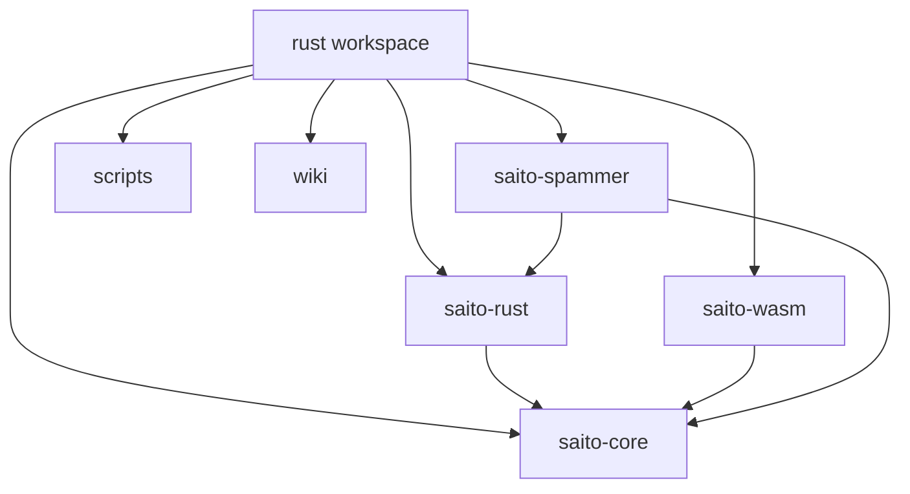
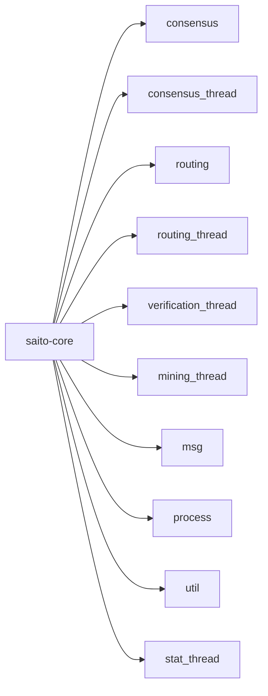
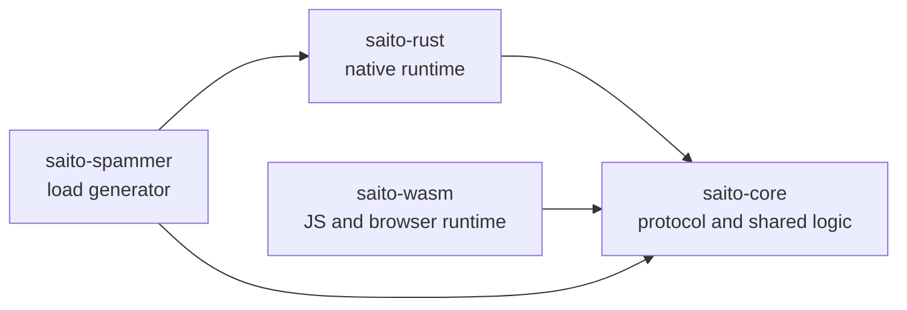

# Codebase Structure

## Workspace Layout

The Rust workspace is declared in `rust/Cargo.toml` and currently includes four crates:

- `saito-core`
- `saito-wasm`
- `saito-rust`
- `saito-spammer`

These crates are designed around a shared-core model.

## Workspace Map

## Top-Level Directories

### `saito-core`

This is the protocol and shared-runtime crate. If the goal is to understand how Saito works, this is the primary place to read.

Important areas under `saito-core/src/core/`:

- `consensus/`: protocol data structures and consensus algorithms
- `consensus_thread.rs`: orchestration of mempool and blockchain state
- `routing/`: peer management, network abstractions, and sync helpers
- `routing_thread.rs`: network-message controller
- `verification_thread.rs`: validation workers for blocks and transactions
- `mining_thread.rs`: golden-ticket mining loop
- `msg/`: wire-level protocol messages
- `process/`: shared event-loop interfaces and time helpers
- `stat_thread.rs`: metrics and state reporting
- `util/`: configuration, crypto, serialization, test helpers, and utilities

### `saito-rust`

This crate is the native node runtime. It binds `saito-core` to:

- Tokio task scheduling
- websocket networking
- HTTP block fetches
- disk-backed block and issuance storage
- config loading
- logging and process lifecycle hooks

Important files:

- `src/main.rs`: node startup, wiring, alternate execution modes
- `src/network_controller.rs`: websocket server, outbound connections, block fetching
- `src/rust_io_handler.rs`: native implementation of the core I/O interface
- `src/run_thread.rs`: generic event-loop runner for processors
- `src/config_handler.rs`: config loading and translation

### `saito-wasm`

This crate exposes the same core logic to JavaScript via `wasm-bindgen`.

Important areas:

- `src/saitowasm.rs`: main WASM wrapper and runtime assembly
- `src/wasm_io_handler.rs`: browser-compatible I/O bridge
- `src/wasm_*` modules: type adapters exported to JavaScript

The crate reuses `RoutingThread`, `ConsensusThread`, `MiningThread`, and `VerificationThread` from `saito-core` instead of reimplementing the protocol.

### `saito-spammer`

This is an auxiliary tool crate used to generate traffic and exercise the node under load.

It depends on both `saito-core` and `saito-rust`, which makes it useful for performance testing and operational validation rather than protocol design.

### `scripts`

Workspace-level scripts for setup, build, and release tasks.

### `wiki`

This directory is intended for internal architectural and design notes such as the documents in this set.

### `target`

Cargo build output. This directory is generated and not part of the conceptual architecture.

## How `saito-core` Is Organized

The internal structure of `saito-core` reflects the main protocol responsibilities.

### Consensus Domain

Files under `consensus/` define the ledger and block-processing model:

- `block.rs`: block representation, serialization, derived metadata
- `blockchain.rs`: canonical chain state, chain selection, reorg handling
- `mempool.rs`: pending transactions, pending blocks, local bundling rules
- `transaction.rs`: transaction format, fees, routing work, validation
- `slip.rs`: UTXO inputs and outputs
- `wallet.rs`: key management, spend selection, wallet updates, staking support
- `burnfee.rs`: dynamic work-threshold calculations
- `golden_ticket.rs`: ticket structure and difficulty validation
- `merkle.rs`: merkle construction utilities
- `blockring.rs`: compact tracking of chain position and longest-chain state

### Routing Domain

Files under `routing/` manage peer-to-peer behavior:

- `io/`: transport and storage abstractions used by the core
- `peers/`: peer records, congestion control, rate limiting, and peer services
- `blockchain_sync_state.rs`: sync bookkeeping used during block download and catch-up

### Processing Domain

Files under `process/` hold the common runtime contracts:

- `process_event.rs`: processor trait used by the runtime loops
- `keep_time.rs`: time abstraction and timer helpers
- `run_task.rs`: task-execution abstraction used by context initialization
- `version.rs`: version handling

### Messaging Domain

Files under `msg/` define protocol payloads exchanged between peers, including:

- handshake messages
- block requests
- ghost-chain sync messages
- generic message framing
- application-layer API messages

### Utilities and Tests

The `util/` directory contains shared support code such as:

- configuration types and loading helpers
- cryptographic helpers
- serialization helpers
- balance snapshots
- test infrastructure for simulated nodes and I/O

## How to Read the Codebase

For most engineering tasks, the shortest path is:

1. Start in `saito-rust/src/main.rs` to see runtime wiring.
2. Read `saito-core/src/core/process/process_event.rs` and `saito-rust/src/run_thread.rs` to understand the execution model.
3. Read `saito-core/src/core/routing_thread.rs` and `saito-core/src/core/verification_thread.rs` for the ingress path.
4. Read `saito-core/src/core/consensus_thread.rs`, `mempool.rs`, and `blockchain.rs` for chain state and block production.
5. Read `saito-rust/src/network_controller.rs` or `saito-wasm/src/saitowasm.rs` depending on the runtime you care about.

## Architectural Summary

The key structural decision in this workspace is that the protocol is not embedded into one runtime.

- `saito-core` owns protocol correctness.
- `saito-rust` owns native execution.
- `saito-wasm` owns browser or JS embedding.
- `saito-spammer` owns workload generation.

Once that split is understood, most files in the workspace fall naturally into place.

## Dependency Boundary Diagram

