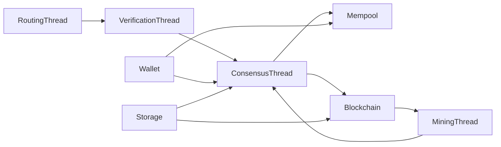
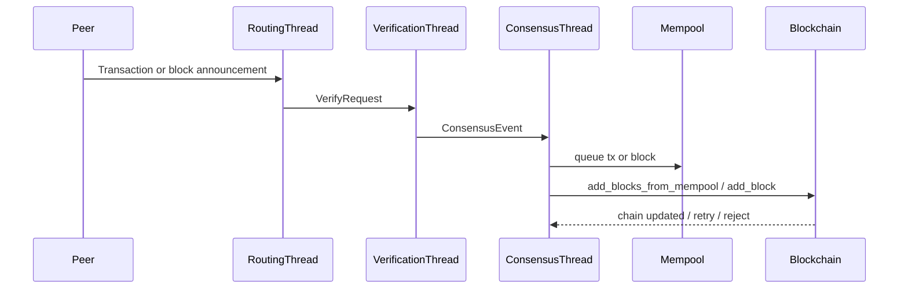
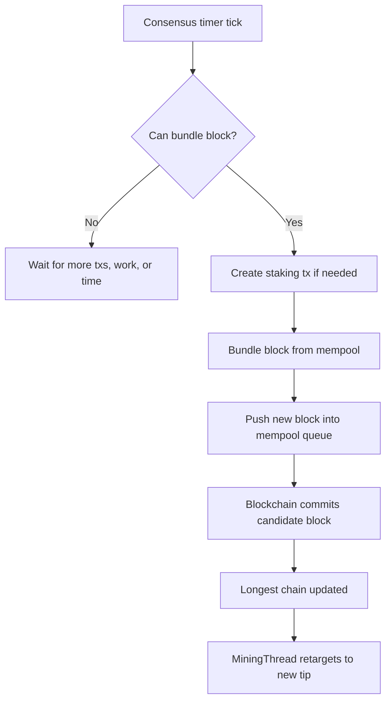

# Consensus Design

## Purpose

The Rust consensus implementation is split between protocol data structures in `saito-core/src/core/consensus/` and the event-driven controller in `saito-core/src/core/consensus_thread.rs`.

At a high level, consensus is responsible for:

- validating and queueing transactions and blocks
- deciding when a node may bundle a block
- committing blocks onto the best chain
- coordinating golden ticket mining and payout eligibility
- maintaining the live UTXO set and chain state

## Consensus at a Glance

## Core Ideas

### Routing Work

Transactions carry fees and accumulate routing metadata as they move through the network. The node computes how much of that work is attributable to itself and stores the aggregate in the mempool.

In the Rust implementation this is represented by:

- `Transaction` and its hop data in `transaction.rs` and `hop.rs`
- per-transaction work accounting in the mempool
- block-level work totals computed during block generation

The mempool uses the accumulated routing work to determine whether it can produce a block.

### Burn Fee

Burn fee is the dynamic threshold that determines how much routing work is needed to create the next valid block.

The implementation lives in `burnfee.rs` and provides two separate calculations:

- the routing work required to produce a block
- the burn fee value recorded for the next block

The work threshold decreases as time passes from the previous block. If enough time elapses, the threshold can fall to zero.

### Golden Tickets

Golden tickets are separate from block production. A golden ticket is a proof that satisfies a difficulty target over the previous block hash plus randomness and the miner public key.

The implementation in `golden_ticket.rs`:

- serializes the ticket payload
- hashes it
- checks whether the resulting hash has enough leading zero bits

Golden tickets are carried as transactions. The consensus thread keeps them in a dedicated mempool index keyed by target block hash so they can be included in the next bundled block.

## Main State Holders

### Blockchain

`Blockchain` in `blockchain.rs` is the canonical chain-state manager. It owns:

- the UTXO set
- the in-memory block index
- the block ring for longest-chain tracking
- latest block metadata such as hash, id, timestamp, and burn fee
- genesis and pruning parameters
- observer hooks for downstream notifications

Its `add_block` and `add_blocks_from_mempool` paths are where chain extension, retry logic, and reorganization decisions happen.

### Mempool

`Mempool` in `mempool.rs` stores three different classes of pending state:

- `blocks_queue` for candidate blocks fetched from peers or bundled locally
- `transactions` for regular transactions waiting to be included
- `golden_tickets` for ticket transactions keyed by target block hash

It also tracks:

- total routing work available in the current transaction set
- whether any new transaction has arrived since the last bundle attempt
- a local UTXO map to reject duplicate input usage before block creation

### Wallet

`Wallet` provides signing keys, staking transaction generation, and wallet-state updates triggered by chain changes. Consensus depends on it for:

- signing issuance and block data
- creating staking transactions during block assembly
- updating spendable outputs after blocks are added or reorganized

## Transaction and Block Processing Diagram

## Consensus Flow

### 1. Transaction Arrival

Transactions typically arrive through the routing layer. The rough path is:

1. `RoutingThread` receives a network `Message::Transaction`.
2. The transaction is forwarded to a verification worker as `VerifyRequest::Transaction`.
3. `VerificationThread` regenerates derived values and validates the transaction against the current UTXO set and blockchain context.
4. Valid transactions are forwarded to consensus as `ConsensusEvent::NewTransaction`.
5. `ConsensusThread` stages them into `txs_for_mempool` and later inserts them into the mempool.

This keeps network I/O, validation, and state mutation separated.

### 2. Block Arrival

Fetched blocks follow a similar path:

1. Routing identifies a missing block and asks the network controller to fetch it.
2. The network controller returns the serialized block buffer through a `NetworkEvent::BlockFetched` event.
3. A verification thread deserializes the block, regenerates its metadata, and checks that the block id and hash match the expected values.
4. The verified block is emitted to consensus as `ConsensusEvent::BlockFetched`.
5. Consensus queues it in the mempool and asks the blockchain to add blocks from the mempool.

### 3. Local Block Production

`ConsensusThread` periodically evaluates whether the node can bundle a new block.

The main checks are implemented in `Mempool::can_bundle_block`:

- the chain must already have a latest block
- there must be no unresolved queued blocks waiting to be processed
- there must be new transactions in the mempool
- golden ticket count rules must be satisfied for the previous block
- available routing work must be greater than or equal to the burn-fee-derived threshold
- a small hash-based delay is applied to reduce zero-fee fork races

If the conditions hold, `Mempool::bundle_block`:

- creates any required staking transaction
- assembles a new `Block` from mempool transactions
- optionally inserts a golden ticket transaction
- signs and generates derived block metadata
- clears the consumed mempool state

Consensus then re-inserts the new block into the mempool queue and asks the blockchain to process it like any other candidate block.

### 4. Chain Commitment

`Blockchain::add_block` is responsible for determining whether a block can be accepted, retried later, or rejected.

Its responsibilities include:

- rejecting duplicate or obviously invalid blocks
- requiring parent availability when the chain is already initialized
- inserting blocks into internal indices
- computing longest-chain updates and reorganizations
- updating wallet state and confirmations
- pruning or downgrading block data when older history is no longer needed

Consensus does not bypass this path for locally produced blocks. All candidate blocks, whether local or remote, are funneled through the same chain-management logic.

### 5. Mining Loop

Mining is handled by `MiningThread` and is intentionally separate from bundling blocks.

When a longest-chain block is added, mining receives `MiningEvent::LongestChainBlockAdded` containing:

- the target block hash
- the required difficulty
- the block id

The mining thread repeatedly generates random bytes, builds a `GoldenTicket`, and validates it against the difficulty threshold. When successful, it sends `ConsensusEvent::NewGoldenTicket` back to consensus, where the ticket is wrapped as a transaction and stored for inclusion in the next block.

## Local Block Production Diagram

## Genesis and Initial Loading

Consensus startup has dedicated logic for bootstrapping the chain:

- issuance slips are loaded from storage and converted into issuance transactions
- if the chain is empty and genesis generation is enabled, a genesis block is bundled
- persisted block metadata is loaded from configuration
- blocks found on disk are loaded into the mempool and replayed into the blockchain

This allows the same controller to handle both fresh nodes and restarted nodes with persisted history.

## Why the Design Is Split This Way

The Rust implementation separates concerns into protocol state plus event processors:

- `consensus/` defines the protocol objects and rules
- `consensus_thread.rs` orchestrates state transitions and timers
- `verification_thread.rs` isolates expensive or adversarial input validation
- `routing_thread.rs` owns peer-facing message handling
- `mining_thread.rs` owns hash-search work

That split keeps consensus deterministic while allowing different runtimes, such as native Rust or WASM, to reuse the same protocol code.