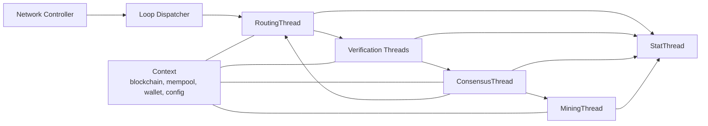
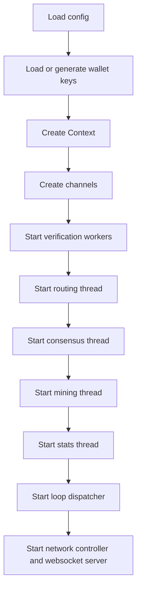

# Node Architecture

## Overview

The native Rust node is built in layers:

1. `saito-core` provides the shared protocol implementation.
2. `saito-rust` supplies runtime services such as networking, disk I/O, configuration, logging, and process startup.
3. Tokio tasks run a set of long-lived event processors that communicate over bounded channels.

The main entrypoint is `saito-rust/src/main.rs`.

## Runtime Topology



## Startup Sequence

The `run_node` function assembles the runtime in a fixed order.

### Configuration and Wallet

Startup begins by:

- loading configuration values
- generating or loading wallet keys
- reading server and consensus parameters such as channel sizes, heartbeat timing, genesis period, and verification thread count

These values are used to construct a shared `Context` containing:

- `blockchain_lock`
- `mempool_lock`
- `wallet_lock`
- `config_lock`

The context is the shared state backbone used by the event processors.

### Channels

The node then creates Tokio channels for inter-thread communication. The important ones are:

- routing events
- consensus events
- mining events
- verification requests
- stats events
- I/O events between core logic and the network controller

The design favors explicit message passing over direct cross-thread mutation.

### Long-Lived Processors

After the shared state and channels are available, the node starts the following processors:

- verification workers
- routing thread
- consensus thread
- mining thread
- stats thread
- loop dispatcher for network events
- network controller and websocket server

All of these run as Tokio tasks.

## Startup Diagram



## Common Event Model

Most processors implement the `ProcessEvent<T>` trait from `saito-core/src/core/process/process_event.rs`.

That trait standardizes five behaviors:

- process a network event
- process an internal event
- process a timer tick
- initialize on startup
- emit periodic stats

The shared helper `run_thread` in `saito-rust/src/run_thread.rs` drives these processors with a loop containing:

- optional reads from an internal event receiver
- optional reads from a network-event receiver
- a timer interval
- a stats interval

This gives each processor a consistent lifecycle while letting it specialize its own event handling.

## Processor Responsibilities

### Routing Thread

`RoutingThread` is the network-facing controller inside the core.

It is responsible for:

- peer lifecycle management
- protocol handshakes and control messages
- forwarding transactions and blocks to verification
- blockchain synchronization requests
- relaying application messages through the I/O interface
- tracking peer congestion and sync state

It does not directly mutate chain state. Instead, it validates message type and origin, then forwards expensive or stateful work to other processors.

### Verification Threads

Verification workers are a protective boundary between untrusted network input and consensus state.

They:

- validate transactions against the current blockchain state
- deserialize blocks fetched from peers
- confirm that fetched blocks match expected ids and hashes
- penalize peers when invalid data is received
- forward only validated items into consensus

This keeps consensus focused on accepted inputs instead of mixed validation logic.

### Consensus Thread

`ConsensusThread` is the state-transition coordinator.

It is responsible for:

- loading persisted chain state and issuance data
- accepting verified transactions and blocks
- inserting items into the mempool
- deciding when to bundle a new block
- committing blocks from the mempool into the blockchain
- sending follow-up events to routing and mining

Although `Blockchain` contains the canonical chain logic, `ConsensusThread` decides when those methods are invoked.

### Mining Thread

`MiningThread` is activated whenever a new longest-chain block is added.

It:

- tracks the current target hash and difficulty
- performs repeated golden-ticket hash attempts on timer ticks
- emits a new golden ticket back to consensus when one is found

Mining is therefore coupled to the chain tip but decoupled from networking and block assembly.

### Stats Thread

`StatThread` aggregates state and performance metrics coming from the other processors. This is operational plumbing rather than protocol logic, but it is part of the node runtime and is started as a first-class processor.

### Network Controller

The network controller in `saito-rust/src/network_controller.rs` is the Rust-specific transport layer.

It is responsible for:

- opening websocket server endpoints
- dialing outbound peers
- maintaining socket senders
- fetching full blocks over HTTP when requested
- translating transport events into `NetworkEvent` messages understood by the core

This layer is intentionally outside `saito-core` so the protocol code does not depend on a specific transport stack.

## Storage and I/O Abstraction

Core processors do not access operating system services directly. Instead they work through abstractions:

- `Network` wraps peer state plus an `InterfaceIO` implementation
- `Storage` wraps block and issuance persistence through the same I/O abstraction
- `RustIOHandler` connects those abstractions to the native runtime

This is what makes the same consensus and routing logic reusable in both `saito-rust` and `saito-wasm`.

## End-to-End Message Paths

```mermaid
sequenceDiagram
	participant Socket as Websocket / HTTP
	participant Controller as Network Controller
	participant Loop as Loop Dispatcher
	participant Routing as RoutingThread
	participant Verify as VerificationThread
	participant Consensus as ConsensusThread
	participant Chain as Blockchain

	Socket->>Controller: inbound message or fetch result
	Controller->>Loop: IoEvent / NetworkEvent
	Loop->>Routing: network event
	Routing->>Verify: VerifyRequest
	Verify->>Consensus: ConsensusEvent
	Consensus->>Chain: chain mutation
```

### Incoming Transaction

1. Network controller receives a websocket message.
2. Loop dispatcher forwards it to `RoutingThread`.
3. Routing parses `Message::Transaction` and forwards it to a verification worker.
4. Verification validates it and emits `ConsensusEvent::NewTransaction`.
5. Consensus stages it for mempool insertion and future block production.

### Incoming Block

1. Routing decides a block is needed and triggers a fetch.
2. Network controller downloads the block bytes.
3. Verification deserializes and checks the block.
4. Consensus places it in the mempool queue.
5. Blockchain attempts to add it to the best chain.

### Local Block Production

1. Consensus timer fires.
2. Mempool checks whether enough routing work exists.
3. A new block is bundled and pushed through blockchain commit logic.
4. Routing is notified of blockchain changes.
5. Mining is retargeted to the new longest-chain tip.

## Native Node Versus WASM Runtime

The WASM crate constructs almost the same set of controllers, but it replaces native networking and storage with a browser-compatible I/O layer. This is a key architectural choice:

- protocol logic lives in `saito-core`
- runtime integration lives in `saito-rust` or `saito-wasm`

That boundary keeps the consensus implementation portable while preserving a full standalone node for native deployments.